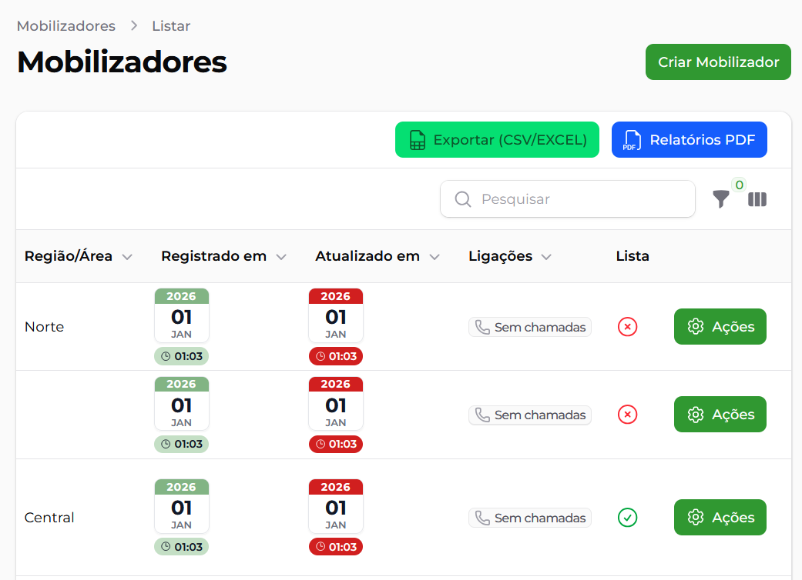

# Filament Calendar Column

[](https://packagist.org/packages/clavifa/filament-calendar-column)
[](https://packagist.org/packages/clavifa/filament-calendar-column)
[](https://packagist.org/packages/clavifa/filament-calendar-column)

A customizable calendar-style table column plugin for [Filament 5](https://filamentphp.com/).

The plugin displays a date value as a compact calendar with year, day, month and optional time.

---

## Preview



---

## Requirements

- PHP `^8.3`
- Filament `^5.0`

---

## Installation

Install the package using Composer:

```bash
composer require clavifa/filament-calendar-column
```

---

## Registering the plugin

This package is a Filament Panel Plugin.

Open your Filament Panel Provider:

```bash
app/Providers/Filament/AdminPanelProvider.php
```

Import the plugin:

```php
use Clavifa\FilamentCalendarColumn\FilamentCalendarColumnPlugin;
```

Then register it in your `panel()`:

```php
public function panel(Panel $panel): Panel
{
    return $panel
        // Other panel configuration...

        ->plugin(
            FilamentCalendarColumnPlugin::make()
        );
}
```

You can also register multiple plugins using plugins():

```php
->plugins([
    FilamentCalendarColumnPlugin::make(),
])
```

After that, the plugin will be available for use in Filament tables.

---

## Basic usage

Import the column:

```php
use Clavifa\FilamentCalendarColumn\Columns\CalendarColumn;
```

Then use it in your Filament table:

```php
CalendarColumn::make('created_at')
    ->label('Registered in');
```

You can also use any other date/datetime column:

```php
CalendarColumn::make('updated_at')
    ->label('Updated on');
```

```php
CalendarColumn::make('last_login_at')
    ->label('Last access');
```

The column uses the state of the field passed to make().

---

## Configuration

The column provides several methods to customize its appearance and behavior.

### `calendarColor()`

Defines the text color of the year displayed in the calendar header -(Default: `#FFFFFF`)\_

```php
CalendarColumn::make('created_at')
    ->calendarColor('#F3F3F3');
```

### `calendarBackground()`

Defines the background color of the calendar header containing the year.. _(Default: `#82b484`)_

```php
CalendarColumn::make('created_at')
    ->calendarBackground('#2563EB');
```

### `timeColor()`

Defines the text and icon color of the time badge. _(Default: `#111827`)_

```php
CalendarColumn::make('created_at')
    ->timeColor('#FFFFFF');
```

### `timeBackground()`

Defines the background color of the time badge. _(Default: `#c4dfc5`)_

```php
CalendarColumn::make('created_at')
    ->timeBackground('#2563EB');
```

### `showTime()`

Controls whether the time badge is displayed. _(Padrão: `true`)_

By default, the time is visible.

```php
// is visible
CalendarColumn::make('created_at')->showTime();

// is hide
CalendarColumn::make('created_at')->showTime(false);
```

### `monthFormat()`

Defines the format used to display the month.

The value is passed to Carbon's `translatedFormat()` method. _(Default: `M`)_

```php
// Produces (ex: AUG)
CalendarColumn::make('created_at')->monthFormat('M');

// Produces (ex: AUGUST)
CalendarColumn::make('created_at')->monthFormat('F');
```

### `monthLocale()`

Defines the locale used specifically when formatting the month. _(Default: `pt_BR`)_

```php
CalendarColumn::make('created_at')
    ->monthLocale('pt_BR');

CalendarColumn::make('created_at')
    ->monthLocale('en_US');

CalendarColumn::make('created_at')
    ->monthLocale('es_ES');
```

### `timeFormat()`

Defines the format of the time displayed below the calendar.
The value is passed to Carbon's `format()` method. _(Default: `H:i`)_

```php
CalendarColumn::make('created_at')
    ->timeFormat('H:i:s');
```

---

## Examples

### Complete example

```php
use Clavifa\FilamentCalendarColumn\Columns\CalendarColumn;

CalendarColumn::make('updated_at')
    ->label('Updated on')
    ->calendarColor('#FFFFFF')
    ->calendarBackground('#82b484')
    ->timeColor('#FFFFFF')
    ->timeBackground('#c4dfc5')
    ->showTime(true)
    ->monthFormat('M')
    ->monthLocale('pt_BR')
    ->timeFormat('H:i:s')
    ->sortable();
```

### Example without the time

```php
CalendarColumn::make('created_at')
    ->showTime(false);
```

### Example with a full month name

```php
CalendarColumn::make('created_at')
    ->monthFormat('F')
    ->monthLocale('pt_BR');
```

### Customized example

```php
CalendarColumn::make('updated_at')
    ->calendarColor('#FFFFFF')
    ->calendarBackground('#2563EB')
    ->timeColor('#FFFFFF')
    ->timeBackground('#1D4ED8')
    ->showTime(true)
    ->monthFormat('M')
    ->monthLocale('pt_BR')
    ->timeFormat('H:i')
    ->sortable();
```

---

## Defaults

| Setting             | Default   |
| :------------------ | :-------- |
| Year color          | `#FFFFFF` |
| Calendar background | `#82b484` |
| Time color          | `#111827` |
| Time background     | `#c4dfc5` |
| Show Time           | `true`    |
| Month format        | `M`       |
| Month locale        | `pt_BR`   |
| Time format         | `H:i`     |

---

## Using sorting and toggleable columns

Since `CalendarColumn` is a `ViewColumn`, it can use the methods normally available for Filament table columns:

```php
CalendarColumn::make('updated_at')
    ->sortable()
    ->searchable()
    ->toggleable(isToggledHiddenByDefault: true);
```

---

## Date fields

The column was designed to work with `date` and `datetime` fields. Ensure that the attribute is being converted into a `Carbon` instance by Eloquent:

```php
protected function casts(): array
{
    return [
        'registered_at' => 'datetime',
        'last_login_at' => 'datetime',
    ];
}
```

---

## API Reference

| Method                 | Default   | Description         |
| :--------------------- | :-------- | :------------------ |
| `calendarColor()`      | `#FFFFFF` | Year text color     |
| `calendarBackground()` | `#82b484` | Header background   |
| `timeColor()`          | `#111827` | Time and icon color |
| `timeBackground()`     | `#c4dfc5` | Time background     |
| `showTime()`           | `true`    | Show or hide time   |
| `monthFormat()`        | `M`       | Month format        |
| `monthLocale()`        | `pt_BR`   | Month language      |
| `timeFormat()`         | `H:i`     | Time format         |

---

## Licença

Este pacote é distribuído sob a licença [MIT](LICENSE).
